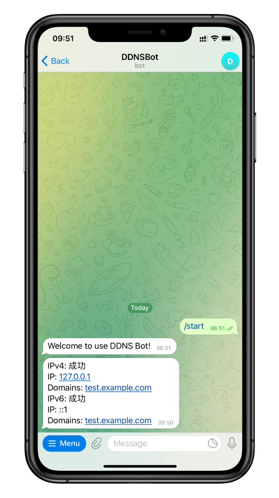

# ddns-telegram-bot


一个用于接收 [ddns-go](https://github.com/jeessy2/ddns-go) 通知的 Telegram 机器人



## 使用

1. 打开并启用 https://t.me/DDNSGoBot
2. 发送 `/gethook` 命令
3. 复制 Webhook URL 并粘贴
4. 复制 RequestBody 并粘贴
```json
{
    "ipv4": {
        "result": "#{ipv4Result}",
        "addr": "#{ipv4Addr}",
        "domains": "#{ipv4Domains}"
    },
    "ipv6": {
        "result": "#{ipv6Result}",
        "addr": "#{ipv6Addr}",
        "domains": "#{ipv6Domains}"
    }
}

```

## 感谢

- [ddns-go](https://github.com/jeessy2/ddns-go)
- [telegram-bot-api](https://github.com/go-telegram-bot-api/telegram-bot-api)
